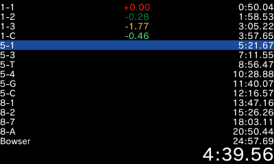

# 3DSplit
A speedrunning timer for the (New) Nintendo 3DS (XL).

## How to use
Download the 3DSplit.3dsx from the [releases](https://github.com/LetsPlentendo-CH/3DSplit/releases) and copy it to your /3ds/ folder on the SD card of your [homebrewed 3DS](https://3ds.guide).

### Adding splits
If you have no splits on your SD card, 3DSplit will create an empty split file which will not be saved to your SD card, so you should import splits from your PC.

First, you need to find your LiveSplit splits (they should be .lss files). If you use a different splitter than LiveSplit, you can upload the file to [splits.io](https://splits.io/) and click Export -> LiveSplit.

Once you have a .lss file, drag it onto [this](https://letsplentendo-ch.github.io/3DSplit/converter/) page and download the splits.spl file, which you can rename to anything else (the ".spl" part must stay, otherwise 3DSplit won't recognize it).

Navigate to your 3DS SD card and create/go into the folder named "splits" and copy the .spl file into there.
Put your SD card back into the 3DS and launch the app from the homebrew launcher.
Have fun!

### Splitting
You can either use the touchscreen or the buttons for splitting, although I highly recommend using the buttons as it's a more precise and you won't risk the 3DS not registering a touch input.

A: start/split

B: Undo split

X: Skip split

L+R: reset

D-Pad Up/Down: scroll up/down in splits

## How to build
### Prerequisites
This project was made with the devkitpro, libctru and citro2d C libraries, so you will need to install [devkitpro](https://www.3dbrew.org/wiki/Setting_up_Development_Environment#Setup) before building.
### Build
After setting up devkitpro, you can navigate to the /3DSplit/ folder and run `make`. Transfer the 3DSplit.3dsx file to your SD card and you're done!

## Thanks
This project would not have been possible without the awesome 3DS modding community and the devkitpro/libctru/citro2d developers.
Also, this project never would have been created if our fellow speedrunner DCA had a second phone or a PC to install a splitting app!
